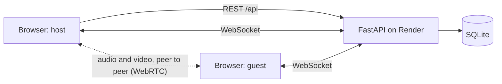
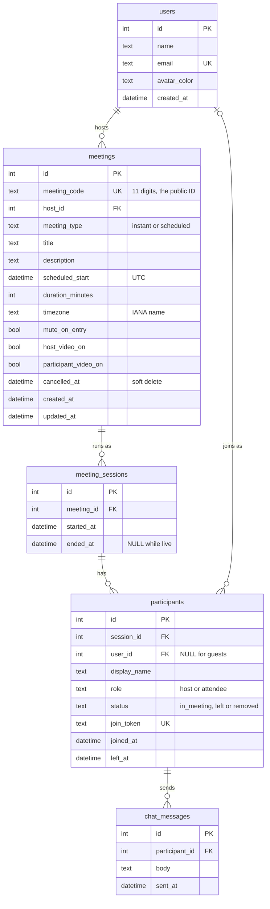

# Zoom Clone

A video meetings web app modelled on Zoom's web portal and meeting room. You can start a meeting instantly, schedule one for later, join by meeting ID or invite link, and meet with live audio and video in the browser. Inside a meeting there is a participants list, chat, screen sharing and host controls.

| | |
|---|---|
| **Live app** | https://zoom-clone-plum-six-29.vercel.app |
| **API** | https://zoom-clone-syuj.onrender.com (interactive docs at [`/docs`](https://zoom-clone-syuj.onrender.com/docs)) |
| **Repository** | https://github.com/naveenk2608/zoom-clone |

> The backend runs on Render's free tier, which sleeps after a period without traffic. The first request after that can take up to a minute; if the dashboard shows "Could not reach the server", wait a moment and press **Retry**.

## Try it in two minutes

1. Open the app. You are signed in as the demo user, **Alex Morgan**, and the dashboard shows seeded upcoming and recent meetings.
2. Click **New meeting**. You land in the meeting room as the host.
3. Click the **ⓘ** icon at the top left, copy the invite link and open it in an **incognito window** (or on another device). Enter a name and click **Join**. Each browser tab acts as a separate person.
4. Try mic and camera, **Chat**, **Share** (desktop browsers), switching between Speaker and Gallery view with the grid icon at the top right, and the host controls: **Host tools → Mute All**, the **…** menu on a row in **Participants** (Mute, Remove), and **End → End Meeting for All**.
5. Back on Home, click **Schedule**, fill in the form and save. The meeting appears under Upcoming meetings. Ended meetings appear under Recent meetings.

## Features

### Core features

- **Dashboard.** Zoom-style top navigation (Schedule, Join, Host, and an avatar menu with Profile and Settings placeholders), a sidebar, a profile card and quick actions (Schedule, Join, New meeting).
  - **Upcoming meetings** are grouped under Today, Tomorrow and then the date. Meetings that are running sit under "In progress". Each card has Start (or Join), Copy Invitation, and a "…" menu with Edit and Delete.
  - **Recent meetings** shows how long each meeting actually ran and how many people attended.
- **Instant meeting.** Creates a unique 11-digit meeting ID (shown as `123 4567 8901`), an invite link of the form `/j/<meeting id>`, and takes you straight into the room as host.
- **Join meeting.** Accepts a meeting ID (spaces and dashes are fine) or a full invite link, and checks that the meeting exists before leaving the page.
  - The pre-join screen has a camera preview with Mute and Stop Video, your display name, and "Remember my name for future meetings".
  - Invalid, cancelled and ended meetings each get a clear message. A blocked or missing camera never stops you from joining.
- **Schedule meeting.** Topic, description, date, start time, duration, time zone, host and participant video, and "Mute participants upon entry". The meeting is saved, gets its invite link and shows in Upcoming. It can be edited or deleted later, and Copy Invitation produces Zoom-style invitation text.

### Meeting room

- Live audio and video between browsers over WebRTC, with Zoom's two layouts:
  - **Speaker view** (the default) shows the active speaker large, outlined in green while they talk, and everyone else in a row of small tiles just above.
  - **Gallery view** shows everyone in an equal grid.
  - Every tile keeps a 16:9 shape. Tiles have a mirrored self view, name labels and muted-mic indicators. With the camera off, the host's tile shows their initial and a guest's tile shows their name.
- A live participants list, a meeting info popover (invite link with a copy button, meeting ID, host), Leave, and End Meeting for All.
- Refreshing the page rejoins the meeting. If the connection drops, the room offers Rejoin.

### Bonus features

- **Host controls:** Mute All, mute one participant, and remove a participant. A muted person can unmute themselves, as in Zoom. A removed person is disconnected, and their join token is refused from then on, so refreshing the page doesn't bring them back.
- **Chat** inside the meeting, saved to the database.
- **Screen sharing** in desktop browsers.
- **Responsive design:** the dashboard stacks on small screens, the meeting toolbar moves less-used buttons into More when space is short, and the side panels go full screen on phones.

## Tech stack

| Layer | Choice |
|---|---|
| Frontend | Next.js 16 (App Router, run as a single-page app), React 19, TypeScript in strict mode |
| Styling and UI | Tailwind CSS 4, Radix UI primitives (dialog, dropdown menu, popover, tooltip), lucide-react icons |
| Backend | Python 3.11, FastAPI, Uvicorn, Pydantic and pydantic-settings |
| Database | SQLite through SQLAlchemy 2 |
| Real time | One WebSocket per participant for presence, chat, host commands and WebRTC signaling. Audio and video go directly between browsers over WebRTC. |
| Tests | pytest with FastAPI's TestClient |
| Hosting | Vercel (frontend), Render (backend) |

## Architecture



- **The frontend is a single-page app.** Pages are client components, and all data is fetched from the browser through one typed API client (`lib/api.ts`). There are no Next.js API routes.
- **REST for data, a WebSocket for the live meeting.** The REST API under `/api` handles meetings and the dashboard. Each participant in a meeting holds one WebSocket at `/ws/meetings/{code}`, which carries who is in the meeting, mic and camera state, chat, host commands and the WebRTC signaling messages.
- **Media never passes through the server.** Every pair of browsers connects directly (a mesh); the server only relays the messages that set those connections up.
- **SQLite is the record; memory is the present.** The database stores meetings, each run of a meeting, attendance and chat. Who is connected right now lives in an in-memory connection manager.

**Backend layout.** Routers only parse the request and return a response. Business rules live in `services/`, which raise small domain errors (`NotFound`, `Gone`, `Conflict`, …) that one exception handler turns into `{"detail": "..."}` with the right status code. Pydantic schemas define every request and response, and `realtime/` holds the WebSocket endpoint, its message types and the connection manager.

**Frontend layout.** Components only display what they are given. Meeting logic lives in hooks: `useMeetingRoom` combines `useLocalMedia` (mic and camera), `useMeetingSocket`, `usePeerConnections` (WebRTC), `useChat` and `useScreenShare`, and `useActiveSpeaker` measures each remote microphone's level with the Web Audio API to pick who is speaking. Shared helpers (meeting code parsing, dates and time zones, invitation text, WebRTC setup) live in `lib/`, and `types/` mirrors the backend's API and WebSocket shapes exactly.

## Database design



### Tables

- **`users`**: people with an account. The demo has no sign-in, so one seeded user is always "logged in".
- **`meetings`**: a meeting as planned, either instant or scheduled. Its public identity is `meeting_code`, separate from the internal integer `id`, so internal IDs never appear in URLs and the public format could change later.
- **`meeting_sessions`**: each actual run of a meeting (Zoom calls this a meeting instance). A scheduled meeting can run more than once, and Recent meetings needs the real start and end times and who attended each run. Keeping runs separate from the plan makes that possible. `ended_at` is `NULL` while a session is live.
- **`participants`**: one row per join of a session. Guests have no account, so `user_id` is `NULL` for them. `join_token` is a random secret returned when you join, and it authenticates that person's WebSocket. `status` records whether they are in the meeting, left, or were removed by the host.
- **`chat_messages`**: messages sent during a session, linked to the participant who sent them.

### Rules enforced by the database

The database enforces these rules itself, so bad data can't get in through any code path:

- **Meeting codes** are unique and must be exactly 11 digits.
- **At most one live session per meeting**, through a partial unique index on `meeting_sessions(meeting_id) WHERE ended_at IS NULL`.
  - If two people open a not-yet-started meeting at the same moment, both requests try to start a session. The index rejects the second insert, and that request rolls back and joins the session that won, so neither person sees an error.
- **Scheduled meetings must have a start time, duration and time zone**: a CHECK that applies only when `meeting_type = 'scheduled'`.
- **Value ranges:**
  - Duration is 15–1440 minutes.
  - Title length is 1–200, description up to 2000, display name 1–100 and chat body 1–2000 characters, matching the API's validation.
  - `role` and `status` are limited to their allowed values.
- **End times can't be earlier than start times**, for both sessions and participants.
- **Foreign keys**: removing a meeting removes its sessions, removing a session removes its participants, and removing a participant removes their chat messages. Deleting a user clears their `participants.user_id`, which keeps attendance history, but a user who hosts meetings can't be deleted while those meetings exist. SQLite ignores foreign keys unless `PRAGMA foreign_keys=ON` is set, so it is set on every connection, together with WAL mode.
- **Indexes for the dashboard queries**: `meetings(host_id, scheduled_start)`, `meeting_sessions(meeting_id, started_at)`, `participants(session_id, status)` and `participants(user_id)`.

### Values that are computed, not stored

- A meeting's **status** (`scheduled`, `live`, `ended` or `cancelled`) comes from `cancelled_at`, whether it has a live session, and its type. Instant meetings are single-use.
- **Upcoming** lists the user's meetings that are live or haven't finished yet, live ones first, then by start time.
- **Recent** lists ended sessions the user hosted or attended, newest first, with the actual duration (`ended_at − started_at`) and the number of people who attended.

### Time zones

SQLite has no time-zone-aware type, so a small custom column type stores every timestamp as UTC and returns it as an aware UTC datetime. When you schedule a meeting, the browser sends the wall-clock date, time and IANA time zone you picked, and the server converts them to UTC with `zoneinfo`, which handles daylight-saving changes. The API returns ISO 8601 times, and the browser shows them in your local time.

## REST API

All paths are under `/api`. Errors use `{"detail": "..."}` with a message the UI can show as it is.

| Method | Path | What it does | Notable responses |
|---|---|---|---|
| GET | `/api/health` | Liveness check, also used to wake the server | `{"status": "ok"}` |
| GET | `/api/me` | The signed-in (default) user | |
| GET | `/api/meetings/upcoming` | Upcoming meetings for the dashboard | |
| GET | `/api/meetings/recent` | Recent (ended) meetings for the dashboard | |
| POST | `/api/meetings/instant` | New meeting: creates the meeting, starts it and joins you as host | Returns the meeting, your participant and a join token |
| POST | `/api/meetings` | Schedule a meeting | 201; 422 for a start time in the past or an unknown time zone |
| GET | `/api/meetings/{code}` | Look up a meeting by its 11-digit ID | 404 if unknown |
| PUT | `/api/meetings/{code}` | Edit a scheduled meeting | 403 if not the host; 409 if cancelled or instant |
| DELETE | `/api/meetings/{code}` | Cancel (soft delete) a meeting | 204; 403 if not the host; 409 while it is live |
| POST | `/api/meetings/{code}/start` | The host starts the meeting, or rejoins it | 403 if not the host; 410 if cancelled, or an instant meeting that has ended |
| POST | `/api/meetings/{code}/join` | Join as a guest with a display name | 404 if unknown; 410 if cancelled, or an instant meeting that has ended |
| GET | `/api/ice-servers` | STUN and TURN servers for the browsers' peer connections | TURN credentials valid for 24 hours |

## WebSocket protocol

Connect to `/ws/meetings/{code}?token=<join token>&audio=0|1&video=0|1`. The `audio` and `video` flags give your starting mic and camera state, so other people never see it flicker.

The server accepts the connection first and then checks the token, because a browser can't read the close code of a refused handshake. If the check fails, it closes with **4001** (invalid token), **4003** (removed by the host) or **4010** (the meeting has ended).

Every message is JSON with a `type` field.

**Client to server**

| Type | Sent when |
|---|---|
| `media_state` | You change your mic, camera or screen share |
| `signal` | A WebRTC offer, answer or ICE candidate for one other participant (`to`) |
| `chat` | You send a chat message |
| `leave` | You click Leave Meeting |
| `host_mute_all`, `host_mute`, `host_remove`, `host_end` | Host controls. The server rejects them from anyone who isn't the host. |

**Server to client**

| Type | Meaning |
|---|---|
| `welcome` | You're in: your own details and everyone already in the meeting |
| `participant_joined`, `participant_left` | Someone arrived or left |
| `media_state` | Someone's mic, camera or screen share changed |
| `signal` | A WebRTC message from another participant (`from`) |
| `chat` | A chat message, with its saved ID and time |
| `force_mute` | The host asked you to mute; your app mutes your mic |
| `removed` | The host removed you; the socket then closes with 4003 |
| `meeting_ended` | The host ended the meeting; the socket then closes with 4010 |
| `error` | A message was refused, with the reason |

**How video is set up.** When someone joins, they send a WebRTC offer to each person listed in `welcome`, and those people only answer. Having only the newcomer make offers means two people never send offers to each other at the same time. ICE candidates that arrive before the connection is ready are queued and added afterwards. Before the room connects, the browser loads its ICE servers from `/api/ice-servers`: Google's STUN, plus a TURN relay for networks where a direct connection fails. The TURN password is a short-lived HMAC of the username (the standard TURN REST scheme), so the shared secret stays on the server. If that request fails, STUN alone is used. Adding `?relay=1` to a room's URL forces every connection through TURN, which tests the relay from one computer. Muting only disables the mic track. Turning the camera on or off and screen sharing swap the video track with `replaceTrack`. So connections never need to be renegotiated.

## Meeting lifecycle

- **New meeting** creates the meeting, its live session and the host's participant row in one transaction.
- **Start** (on a scheduled meeting) is only allowed for the meeting's host. It starts a session, or rejoins the live one.
- **Join** always adds a guest attendee. Attendees may join a scheduled meeting before the host, like Zoom's "allow participants to join anytime"; the first join starts the session.
- **A session ends** when:
  - the host clicks End Meeting for All,
  - the last person clicks Leave Meeting,
  - the last connection drops and nobody returns within 30 seconds (a page refresh reconnects well within that time), or
  - the server restarts while it is still marked live; any such session is closed at startup.
- **Instant meetings are single-use.** Once one ends, its link shows "This meeting has ended." Scheduled meetings can run again until they are cancelled.

## Project structure

```
backend/
  app/
    main.py            app setup: CORS, routers, startup (create tables, close stale sessions, seed)
    config.py          settings from environment variables
    db.py              engine, sessions, SQLite pragmas
    deps.py            shared dependencies, including the default "signed-in" user
    models/            SQLAlchemy tables
    schemas/           Pydantic request and response models
    services/          business rules: meeting codes, lifecycle, dashboard, presence, chat
    routers/           REST endpoints (health, users, meetings)
    realtime/          WebSocket endpoint, message types, connection manager, host commands
    seed.py            demo data (with seed_time.py and seed_rows.py)
  tests/               pytest suite
frontend/
  src/
    app/               routes: / (Home), /join, /schedule, /schedule/[code] (edit),
                       /j/[code] (invite link and pre-join), /meeting/[code] (room)
    components/        ui/, layout/, dashboard/, schedule/, join/, prejoin/, meeting/
    hooks/             data loading, media, socket, WebRTC, chat, screen share
    lib/               API client, config, meeting codes, dates and time zones, WebRTC helpers
    types/             API and WebSocket types, mirroring the backend
docs/DECISIONS.md      design decisions, recorded phase by phase
```

## Running locally

**Requirements:** Python 3.11 or newer, Node.js 20.9 or newer (the minimum for Next.js 16), and Git.

### 1. Backend

```bash
cd backend
python -m venv .venv
source .venv/bin/activate          # Windows: .venv\Scripts\activate
pip install -r requirements.txt
cp .env.example .env               # Windows: copy .env.example .env
uvicorn app.main:app --reload --port 8000
```

The API runs at http://localhost:8000, with interactive docs at http://localhost:8000/docs. On first start it creates the SQLite database (`backend/zoom_clone.db`) and fills it with demo data. To start over with fresh demo data, stop the server and delete that file.

### 2. Frontend

In a second terminal:

```bash
cd frontend
npm install
cp .env.example .env.local         # Windows: copy .env.example .env.local
npm run dev
```

Open http://localhost:3000. The `.env.local` step is required: without the `NEXT_PUBLIC_` values, the app stops with an error naming the missing variable.

**Testing a call on one computer.** Start a meeting in a normal window, then open its invite link in an incognito window. Each tab is a separate participant. Browsers only allow camera access on `localhost` or HTTPS, so use `http://localhost:3000` rather than your computer's IP address.

### 3. Tests and checks

```bash
cd backend && pytest               # backend test suite
cd frontend && npm run lint        # ESLint
cd frontend && npm run build       # production build, including the TypeScript type check
```

The backend tests use a temporary SQLite database per test. They cover meeting codes, schedule validation (past start times, unknown time zones, duration limits), join rules (unknown, cancelled and ended meetings, host and guest roles, two people joining at the same moment), the Upcoming and Recent lists, cancelling, the seed data, and the WebSocket: joining, leaving, reconnecting, ending the meeting, host controls and chat.

## Environment variables

**Backend** (`backend/.env`)

| Variable | Example | Purpose |
|---|---|---|
| `DATABASE_URL` | `sqlite:///./zoom_clone.db` | Database location |
| `FRONTEND_BASE_URL` | `http://localhost:3000` | Used to build invite links (`<this>/j/<meeting id>`) |
| `CORS_ORIGINS` | `http://localhost:3000` | Comma-separated list of origins allowed to call the API |
| `TURN_HOST` | `staticauth.openrelay.metered.ca` | TURN relay host, offered on ports 80 and 443 |
| `TURN_SECRET` | `openrelayprojectsecret` | Shared secret the TURN server uses to check the short-lived credentials |

**Frontend** (`frontend/.env.local`)

| Variable | Example | Purpose |
|---|---|---|
| `NEXT_PUBLIC_API_URL` | `http://localhost:8000` | REST API base URL |
| `NEXT_PUBLIC_WS_URL` | `ws://localhost:8000` | WebSocket base URL (`wss://` in production) |
| `NEXT_PUBLIC_TURN_URL`, `NEXT_PUBLIC_TURN_USERNAME`, `NEXT_PUBLIC_TURN_CREDENTIAL` | (optional) | A TURN server for networks where browsers can't connect directly |

## Seed data

The database is seeded at startup whenever it is empty. All times are relative to the current date and fall in office hours in India (10:00–18:00 IST), so the demo always looks current.

- **Users:** Alex Morgan (the signed-in user) and five colleagues: Priya Sharma, Daniel Kim, Sofia Martinez, Rahul Verma and Emily Chen.
- **Upcoming:**
  - Five scheduled meetings over the coming week: Sprint Planning, 1:1 with Priya, Client Demo, Design Review and Team Retrospective.
  - A Daily Standup later today, while office hours remain.
  - A cancelled meeting, which stays out of the lists.
- **Recent:** six ended sessions over the past nine days. They include a meeting that ran twice (Weekly Team Sync), meetings hosted by colleagues that Alex attended, and guests without accounts.

## Deployment

**Backend on Render** (web service, root directory `backend`)

- Build command: `pip install -r requirements.txt`
- Start command: `uvicorn app.main:app --host 0.0.0.0 --port $PORT`
- Health check path: `/api/health`
- Environment: `PYTHON_VERSION=3.11.5`, plus `FRONTEND_BASE_URL` and `CORS_ORIGINS` set to the Vercel URL, with no trailing slash.

**Frontend on Vercel** (root directory `frontend`, Next.js preset)

- Environment: `NEXT_PUBLIC_API_URL=https://<render app>` and `NEXT_PUBLIC_WS_URL=wss://<render app>`.
- `NEXT_PUBLIC_` values are built into the bundle, so set them before building, and redeploy after changing them.

Production must use HTTPS and WSS end to end. Browsers block mixed content, and the camera, microphone and clipboard only work on secure pages.

## Assumptions

- **No login.** As the brief allows, a seeded default user (Alex Morgan) is always signed in. Only one dependency, `get_current_user`, knows this, so adding real authentication means replacing that one function.
- **Who is host.** Only New meeting (or Host) and Start make you the host. Joining through the Join page or an invite link always makes you a guest attendee, even for your own meeting. This is what lets you test host controls from a second tab.
- **Join anytime.** Attendees can join a scheduled meeting before the host arrives.
- **Delete means cancel.** Deleting a meeting marks it cancelled instead of removing the row, which keeps its history. A meeting that is running can't be deleted.
- **Default duration is one hour.** Zoom's 40-minute limit on free accounts is out of scope.
- **If the host leaves without ending the meeting,** it carries on without a host. Zoom would ask the host to hand over the role first.
- **Chat history isn't replayed.** People who join later see only new messages, which is Zoom's default.
- **Out of scope:** recurring meetings, waiting rooms, passcodes, Personal Meeting IDs, recording, breakout rooms, reactions and device selection. Buttons for these features show "Not available in this demo".

## Known limitations

- **Small meetings.** In a mesh, every browser sends its video to every other browser, so this works best for about 2–4 people. Larger meetings would need a media server (an SFU such as mediasoup or LiveKit).
- **Restrictive networks.** Some networks (strict corporate firewalls, carrier NAT on mobile data) block direct connections, so calls there need a working TURN relay. The defaults point at Metered's free Open Relay, a shared service with no guarantees. When last tested it didn't grant relays, so for calls between different networks, set `TURN_HOST` and `TURN_SECRET` to a TURN server you control, such as coturn with `use-auth-secret`. A TURN server with a fixed username and password can also be added on the frontend through the `NEXT_PUBLIC_TURN_*` variables.
- **One backend instance.** Who is connected lives in the server's memory, so the backend can't run as several instances without shared state such as Redis pub/sub.
- **Demo data resets.** Render's free tier doesn't keep files between restarts, so the SQLite database resets whenever the server restarts or sleeps, and the demo data is seeded again.
- **Screen sharing is desktop only.** Mobile browsers don't allow websites to capture the screen; phones show a notice instead.
- **No migrations.** Tables are created at startup with `create_all`; a production version would use Alembic.
- **Edge case:** if someone joins through the API but never opens the meeting page, that session stays live until the server restarts, because only a WebSocket disconnect starts the 30-second timer that ends an empty session.

## Possible next steps

- Real sign-up and login, replacing the default-user dependency.
- A media server (SFU) for larger meetings, and a dedicated TURN server for stricter networks.
- PostgreSQL with Alembic migrations, and Redis so the backend can run as several instances.
- Recurring meetings, a waiting room, passcodes and reactions.
